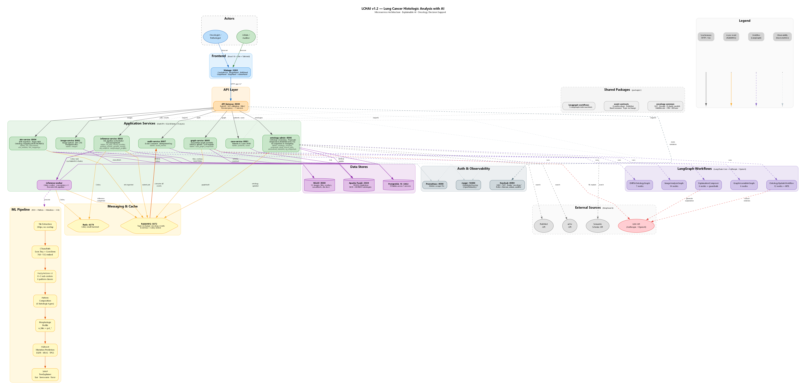
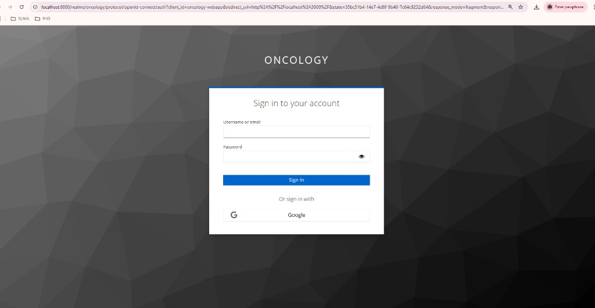
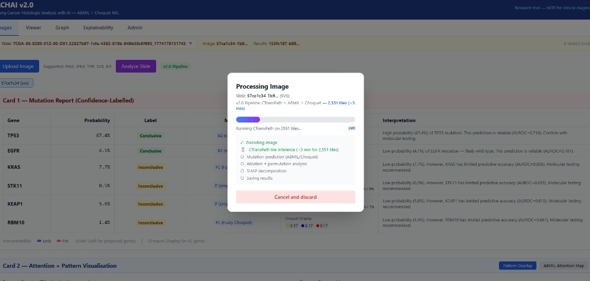
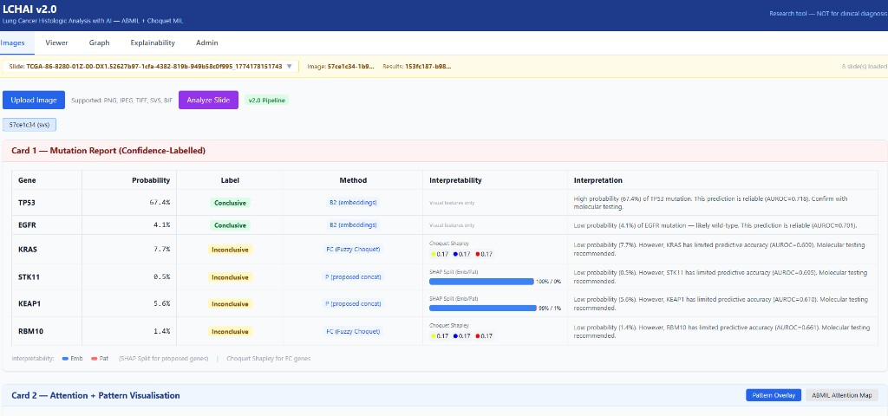
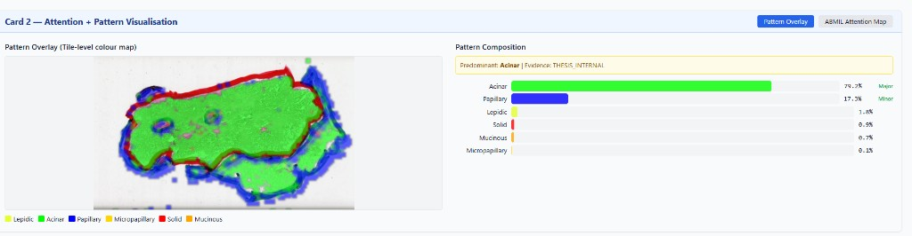
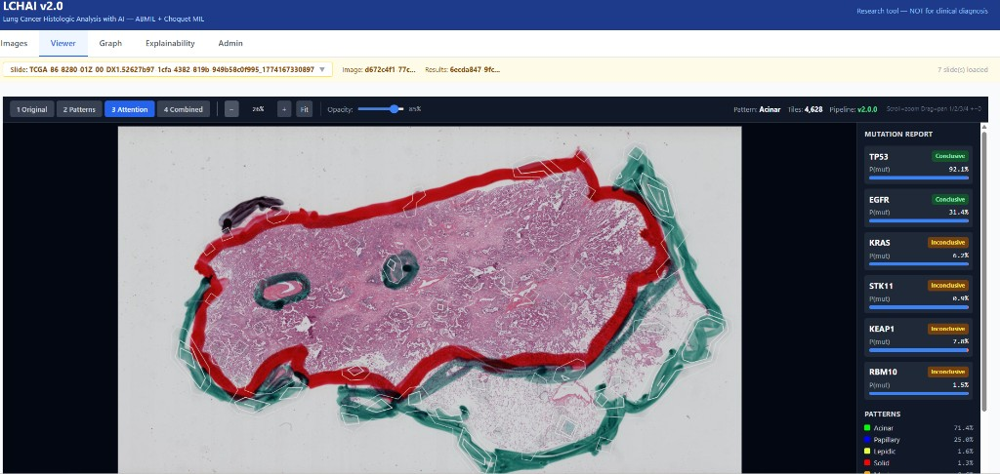
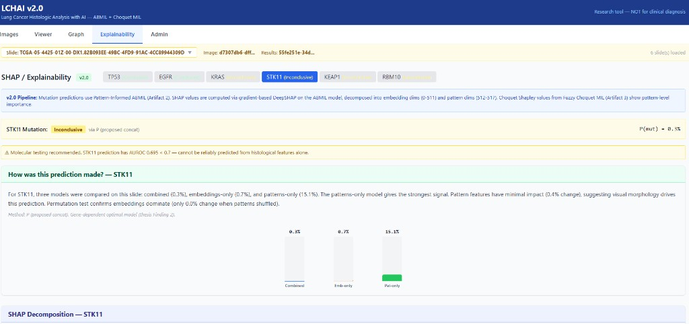

# LCHAI v2.0 — User Manual

**Lung Cancer Histologic Analysis with AI**  
*Explainable mutation prediction from H&E whole-slide images*

> DISCLAIMER: LCHAI v2.0 is a research tool (THESIS_INTERNAL evidence). Mutation predictions use ABMIL + Fuzzy Choquet MIL. Inconclusive genes (AUROC < 0.70) require molecular testing. NOT for clinical diagnosis.

---

## Table of Contents

1. [System Overview](#1-system-overview)
2. [Getting Started — Login](#2-getting-started--login)
3. [Images Tab — Upload and Analyze](#3-images-tab--upload-and-analyze)
   - 3.1 [Uploading an Image](#31-uploading-an-image)
   - 3.2 [Analyzing a Slide](#32-analyzing-a-slide)
   - 3.3 [Card 1 — Mutation Report](#33-card-1--mutation-report)
   - 3.4 [Card 2 — Pattern Visualization](#34-card-2--pattern-visualization)
   - 3.5 [Card 3 — Clinical Summary](#35-card-3--clinical-summary)
4. [Viewer Tab — Image Exploration](#4-viewer-tab--image-exploration)
5. [Graph Tab — Knowledge Graph](#5-graph-tab--knowledge-graph)
6. [Explainability Tab — XAI Results](#6-explainability-tab--xai-results)
7. [Admin Tab — System Parameters](#7-admin-tab--system-parameters)
8. [User Profile and Settings](#8-user-profile-and-settings)
9. [Supported Image Formats](#9-supported-image-formats)
10. [Understanding the Results](#10-understanding-the-results)
11. [Troubleshooting](#11-troubleshooting)

---

## 1. System Overview

LCHAI v2.0 is an AI-powered decision-support system for lung adenocarcinoma (LUAD) histopathology. It analyzes whole-slide images (WSI) to:

- **Classify histological growth patterns**: acinar, lepidic, papillary, micropapillary, solid, mucinous
- **Predict oncogenic mutations**: TP53, EGFR, KRAS, STK11, KEAP1, RBM10
- **Provide explainable AI outputs**: attention maps, SHAP decomposition, Choquet Shapley values, ablation studies
- **Generate knowledge graphs** linking predictions to ontologies (NCIt, MONDO) and treatment associations

*Figure 1: LCHAI v2.0 system architecture — microservices, ML pipeline, and knowledge graph*

### ML Pipeline Summary

The analysis pipeline processes each slide through the following stages:

1. **WSI Decode** — Opens the slide file (SVS, TIFF, or BIF) using OpenSlide. BIF and flat TIFF files are automatically converted to pyramidal format.
2. **Full-Resolution Tiling** — Extracts 224x224 pixel tiles from tissue regions, rejecting artifacts (ink markers, barcodes, background).
3. **CTransPath Inference** (GPU-accelerated) — Each tile is processed by CTransPath (Swin Tiny backbone) to produce 512-dimensional embeddings.
4. **Pattern Classification** — FuzzyArcLoss V2 cosine head classifies each tile into one of 6 histological patterns.
5. **Mutation Prediction** — Gene-specific models (ABMIL or Fuzzy Choquet MIL) predict mutation probability for each of 6 genes.
6. **Explainability** — Ablation comparison, permutation importance, SHAP decomposition, and Choquet Shapley values.

---

## 2. Getting Started — Login

When you navigate to the LCHAI system (typically `http://localhost:3000`), you will be redirected to the authentication page.

*Figure 2: Keycloak login screen with username/password and Google OAuth2 options*

### Login Options

| Method | Description |
|--------|-------------|
| **Username / Password** | Enter your assigned credentials (e.g., `clinician1` / `clinician1`) |
| **Google** | Click "Google" to sign in with your Google account (OAuth2) |

### User Roles

| Role | Access Level |
|------|-------------|
| **Clinician** | Full access to Images, Viewer, Graph, Explainability tabs |
| **Admin** | All clinician access PLUS the Admin tab (system parameters, DeepSearch, ontology management) |
| **Auditor** | Read-only access to the audit trail |

After successful login, you will see the main application with your name and role displayed in the top-right corner.

---

## 3. Images Tab — Upload and Analyze

The Images tab is the primary workspace for uploading slide images and viewing analysis results.

### 3.1 Uploading an Image

1. Click the **"Upload Image"** button (blue)
2. Select a histopathology image file from your computer
3. A **progress bar** will appear showing the upload percentage — this is especially useful for large WSI files (500 MB – 10 GB)
4. Supported formats: PNG, JPEG, TIFF, SVS, BIF
5. After upload completes, the system automatically creates a new case and selects the uploaded slide

**Slide Selector**: The yellow bar at the top shows all uploaded slides. Click the dropdown to switch between slides.

### 3.2 Analyzing a Slide

1. After uploading (or selecting) a slide, click **"Analyze Slide"** (purple button)
2. A **processing modal** appears showing real-time progress:

*Figure 3: Processing modal with progress bar, tile count, estimated time, and stage checklist*

**Processing Stages:**

| Stage | Description | Typical Time |
|-------|-------------|-------------|
| Decoding image | Opens the WSI file, creates thumbnail | 5-10 seconds |
| CTransPath tile inference | GPU processes ~2,500-5,000 tiles | 10-30 seconds (GPU) |
| Mutation prediction | ABMIL/Choquet models for 6 genes | 5-10 seconds |
| Ablation + permutation | Comparison of model variants | 10-20 seconds |
| SHAP decomposition | Feature attribution analysis | 5-15 seconds |
| Saving results | Stores results and overlays in database | 2-5 seconds |

**Total processing time**: Approximately 1-3 minutes with GPU, 5-10 minutes on CPU.

You can click **"Cancel and discard"** at any time to abort the analysis and remove all associated data.

### 3.3 Card 1 — Mutation Report

After processing completes, Card 1 displays the mutation prediction results:

*Figure 4: Card 1 — Mutation Report with confidence labels, methods, interpretability, and interpretation*

**Table Columns:**

| Column | Description |
|--------|-------------|
| **Gene** | The gene being analyzed (TP53, EGFR, KRAS, STK11, KEAP1, RBM10) |
| **Probability** | Predicted mutation probability (0-100%). Higher = more likely mutated |
| **Label** | **Conclusive** (green) if the model's AUROC >= threshold (reliable prediction). **Inconclusive** (yellow) if AUROC < threshold (limited reliability) |
| **Method** | The optimal model used for this gene: B2 (embeddings-only ABMIL), P (pattern-informed ABMIL), or FC (Fuzzy Choquet) |
| **Interpretability** | Visual summary: SHAP split bar (blue=embeddings, red=patterns) for ABMIL genes, or Choquet Shapley values for FC genes |
| **Interpretation** | Natural language explanation of the prediction, including AUROC value and clinical recommendation |

### 3.4 Card 2 — Pattern Visualization

Card 2 shows the spatial distribution of histological patterns detected across the slide:

*Figure 5: Card 2 — Pattern overlay (left) and pattern composition bar chart (right)*

**Two views available** (toggle buttons in top-right):
- **Pattern Overlay**: Color-coded tile-level pattern map overlaid on the H&E image
- **ABMIL Attention Map**: Heatmap showing which regions the AI focused on for mutation prediction

**Pattern Color Legend:**

| Color | Pattern | Clinical Significance |
|-------|---------|----------------------|
| Green | Acinar | Most common LUAD subtype, intermediate prognosis |
| Yellow-green | Lepidic | Best prognosis, associated with EGFR mutations |
| Blue | Papillary | Common subtype, moderate prognosis |
| Gold | Micropapillary | Aggressive, poor prognosis |
| Red | Solid | Aggressive, associated with TP53 mutations |
| Orange | Mucinous | Distinct molecular profile, KRAS-associated |

**Pattern Composition** (right panel): Horizontal bar chart showing the percentage of each pattern. Patterns above 20% are labeled "Major", above 5% are "Minor".

### 3.5 Card 3 — Clinical Summary

Card 3 provides a narrative summary of the analysis in clinical language:

- **Histological analysis**: Number of tiles analyzed, predominant pattern, secondary patterns
- **Reliable predictions** (Conclusive): Genes with AUROC above threshold, with clinical associations
- **Wild-type predictions** (Conclusive, low probability): Genes likely not mutated
- **Requires molecular testing** (Inconclusive): Genes that cannot be reliably predicted from histology alone

---

## 4. Viewer Tab — Image Exploration

The Viewer tab provides a QuPath-like interactive image viewer with zoom, pan, and multiple overlay layers.

*Figure 6: Viewer tab with "2 Patterns" layer selected, showing pattern colors overlaid on the H&E image*

### Layer Controls (top toolbar)

| Button | Layer | Description |
|--------|-------|-------------|
| **1 Original** | H&E image | The original histopathology image (thumbnail for WSI) |
| **2 Patterns** | Pattern overlay | Color-coded histological pattern classification per tile |
| **3 Attention** | ABMIL attention | Heatmap showing high-attention regions with white contour lines |
| **4 Combined** | Patterns + Attention | Both pattern colors and attention contours combined |

### Navigation

| Action | How |
|--------|-----|
| **Zoom in** | Scroll up, press `+`, or click `+` button |
| **Zoom out** | Scroll down, press `-`, or click `-` button |
| **Pan** | Click and drag the image |
| **Reset view** | Click "Fit" or press `0` |
| **Switch layers** | Press keys `1`, `2`, `3`, `4` |

### Opacity Slider

When viewing overlay layers (Patterns, Attention, Combined), use the **Opacity slider** to blend between the overlay and the original image (0% = original only, 100% = overlay only).

### Right Sidebar

The sidebar shows a compact summary of results:
- **Mutation Report**: Mini-cards for each gene with probability and Conclusive/Inconclusive label
- **Patterns**: Color-coded list with percentages
- **Layers**: Clickable list to switch between layers

*Figure 7: Viewer tab with "3 Attention" layer, showing ABMIL attention regions with white contour lines*

---

## 5. Graph Tab — Knowledge Graph

The Graph tab displays an interactive ontology-grounded knowledge graph that links the analysis results to clinical knowledge.

### Building the Graph

1. Click **"Rebuild Graph"** to generate the knowledge graph for the current case
2. The graph is assembled from:
   - Predicted mutations and patterns from the analysis
   - NCIt (National Cancer Institute Thesaurus) ontology relationships
   - MONDO (Monarch Disease Ontology) disease classifications
   - Treatment associations from clinical guidelines (OncoKB/FDA)

### Graph Visualization

The graph uses a force-directed layout (D3.js) with:

| Node Type | Color | Description |
|-----------|-------|-------------|
| Case | Blue | The analyzed case/slide |
| Gene / Mutation | Red | Predicted genes and their mutation status |
| Pattern | Amber | Detected histological patterns |
| Treatment | Purple | Available targeted therapies |
| Diagnosis | Green | Related diagnoses |
| Ontology | Gray | Ontology concepts (NCIt, MONDO) |

**Interactions:**
- Click a node to see its details
- Drag nodes to rearrange
- Scroll to zoom, drag background to pan
- Toggle "Show inferred edges" to see/hide ontology-derived relationships

### AI Explanation

Click **"Explain with AI"** to generate a natural language summary of the knowledge graph. The explanation is generated in your selected language (configurable in user profile) and describes:
- Detected patterns and their clinical significance
- Predicted mutations and reliability
- Available treatments for detected mutations
- Recommendations for molecular confirmation

---

## 6. Explainability Tab — XAI Results

The Explainability tab provides detailed interpretability information for each gene prediction.

*Figure 8: Explainability tab showing gene selector, prediction details, ablation study, and SHAP decomposition*

### Gene Selector

Click on any gene button (TP53, EGFR, KRAS, STK11, KEAP1, RBM10) to view its detailed explainability results. Each button shows whether the prediction is "(conclusive)" or "(inconclusive)".

### Per-Gene Explanation

For each selected gene, the system shows:

#### How was this prediction made?

- **AI-generated explanation** (via OpenAI GPT-4o-mini): A 3-4 sentence summary of what drives the prediction, which input features matter, and clinical implications. Generated in your preferred language.
- **Ablation comparison chart** (3 vertical bars):
  - **Combined**: Probability using both visual embeddings + histological patterns
  - **Emb-only**: Probability using only visual embeddings (512-d)
  - **Pat-only**: Probability using only pattern features (6-d)
  - This shows whether the prediction is driven by visual morphology, histological patterns, or both.

#### SHAP Decomposition (for pattern-informed ABMIL genes: STK11, KEAP1)

- **Embedding vs Pattern contribution**: Stacked bar showing what percentage of the prediction comes from visual embeddings (512 dimensions) vs. histological patterns (6 dimensions)
- **Top contributing patterns**: Which specific patterns (acinar, solid, etc.) most influence the prediction

#### Choquet Shapley Values (for Fuzzy Choquet genes: KRAS, RBM10)

- **Pattern Shapley Values**: Importance of each individual pattern for the prediction
- **Interaction Indices**: Pairwise pattern interactions — "Synergy" means two patterns together are more predictive than the sum of their individual contributions; "Redundancy" means they overlap

#### Morphologic Profile

Grid showing total tile count and percentage breakdown of all 6 histological patterns.

---

## 7. Admin Tab — System Parameters

The Admin tab is only visible to users with the **admin** role. It provides control over system configuration.

*Figure 9: Admin tab — Parameters panel with editable AUROC values, threshold, and inference settings*

### Parameters Panel

#### Editable Parameters

| Parameter | Description | Default |
|-----------|-------------|---------|
| **Gene AUROC values** | Mean AUROC from 5-fold cross-validation for each gene. Determines Conclusive/Inconclusive labels | 0.609 – 0.718 |
| **Method per gene** | The optimal model to use for each gene (B2, P, or FC) | From thesis Finding 2 |
| **AUROC Threshold** | Genes with AUROC >= this value are labeled "Conclusive" | 0.700 |
| **Mutation threshold** | Probability threshold for POS/NEG classification | 0.50 |
| **Top-K attention tiles** | Number of highest-attention tiles to highlight in the attention map | 200 |
| **Max tiles per WSI** | Maximum number of tiles to extract from a whole-slide image | 10,000 |
| **Permutation repeats** | Number of random shuffles for permutation importance | 10 |

Click **"Save All Parameters"** to apply changes. Changes take effect on the next image analysis.

#### Fixed Parameters (read-only)

| Parameter | Value |
|-----------|-------|
| Tile size | 224 px |
| Backbone | CTransPath Swin Tiny |
| Classifier | FuzzyArcLoss V2 |

### Other Admin Sub-tabs

| Sub-tab | Purpose |
|---------|---------|
| **DeepSearch Pipeline** | Run automated literature search across PubMed, arXiv, and Semantic Scholar to discover new gene-pattern-treatment relationships |
| **KG Versions** | View and manage knowledge graph snapshots and changelogs |
| **Ontology Management** | Manage ontology versions (NCIt, MONDO, SO) and create update proposals |
| **Audit Log** | View system event history (image uploads, analyses, parameter changes) |

---

## 8. User Profile and Settings

Click your **name/avatar** in the top-right corner to access the user menu:

- **Profile information**: Name, email, and role badges
- **Explanation language**: Select the language for AI-generated explanations:
  - English, Espanol, Deutsch, Francais, Portugues
  - This affects: Graph tab explanations, Explainability tab per-gene explanations, Clinical Summary text
- **Logout**: End your session and return to the login screen

---

## 9. Supported Image Formats

| Format | Extension | Type | Notes |
|--------|-----------|------|-------|
| **SVS** | `.svs` | Aperio pyramidal | Recommended for large slides. Fastest processing via OpenSlide |
| **TIFF** | `.tif`, `.tiff` | Standard/Pyramidal | Flat TIFFs are automatically converted to pyramidal format |
| **BIF** | `.bif` | Ventana/Roche | Automatically converted to pyramidal TIFF via pyvips |
| **PNG** | `.png` | Standard image | For small tissue sections or exported regions |
| **JPEG** | `.jpg`, `.jpeg` | Standard image | For small tissue sections or exported regions |

### Upload Size Guidelines

| File Size | Expected Upload Time | Processing Time |
|-----------|---------------------|-----------------|
| < 50 MB | < 5 seconds | 30-60 seconds |
| 50-500 MB | 5-30 seconds | 1-2 minutes |
| 500 MB – 2 GB | 30 seconds – 2 minutes | 2-3 minutes |
| 2-10 GB | 2-5 minutes | 3-5 minutes (includes format conversion for BIF/flat TIFF) |

---

## 10. Understanding the Results

### Mutation Probability

The probability (0-100%) represents the model's confidence that the gene is mutated based on histological features:

| Probability | Interpretation |
|-------------|---------------|
| > 70% | Strong evidence of mutation — confirm with molecular testing |
| 50-70% | Moderate evidence — molecular testing recommended |
| 30-50% | Weak/ambiguous signal — molecular testing needed |
| < 30% | Likely wild-type (not mutated) |

### Conclusive vs. Inconclusive

This label refers to the **reliability of the model** for that gene, NOT the presence of the mutation:

- **Conclusive** (AUROC >= 0.70): The model has demonstrated acceptable discrimination on the TCGA-LUAD cohort. The prediction is considered reliable (though not diagnostic).
- **Inconclusive** (AUROC < 0.70): The model has limited accuracy for this gene. The prediction should not be relied upon. Molecular testing is strongly recommended.

### Gene-Specific Clinical Associations

| Gene | Pattern Association | Treatment Implications |
|------|--------------------|-----------------------|
| **TP53** | Solid, micropapillary | No targeted therapy; immunotherapy may benefit |
| **EGFR** | Lepidic, papillary | Osimertinib (3rd gen TKI), erlotinib, gefitinib |
| **KRAS** | Mucinous, solid | Sotorasib (G12C-specific), adagrasib |
| **STK11** | Various | May predict immunotherapy resistance |
| **KEAP1** | Various | Associated with oxidative stress pathway alterations |
| **RBM10** | Various | RNA splicing factor; research-stage implications |

---

## 11. Troubleshooting

### Common Issues

| Problem | Solution |
|---------|----------|
| **Blank screen after login** | Refresh the page (F5). If persistent, clear browser cache |
| **Upload stuck at 0%** | Check your internet connection. For files > 5 GB, ensure stable connection |
| **Processing takes too long** | Normal for CPU processing (~5 min). GPU reduces to ~1 min. Check Admin > Max tiles per WSI |
| **"No results" after processing** | Select the correct slide in the dropdown. Click the image pill to select it, then results should appear |
| **BIF file fails** | Large BIF files (>5 GB) are automatically converted to pyramidal TIFF. This may take extra time. Check worker logs if it fails |
| **Labels don't update after changing Admin parameters** | Labels refresh automatically. If not, reload the page |
| **Admin tab not visible** | Only users with the "admin" role can see this tab. Contact your administrator |
| **Graph shows "mock" badge** | The LLM API key may not be configured. Check with your administrator |
| **Explanation in wrong language** | Click your name (top-right) and change the "Explanation language" setting |

### Performance Tips

- **Use SVS format** for the best performance with large slides
- **Keep Max tiles per WSI at 10,000** for balanced accuracy and speed
- **GPU acceleration** reduces CTransPath inference from ~5 minutes to ~15 seconds
- **Close other browser tabs** when uploading large files (>2 GB)

---

*LCHAI v2.0 — Servio Fernando Lima Reina, PhD Computer Science, University of Fribourg, Switzerland*  
*For research use only. Always confirm AI predictions with molecular testing.*
