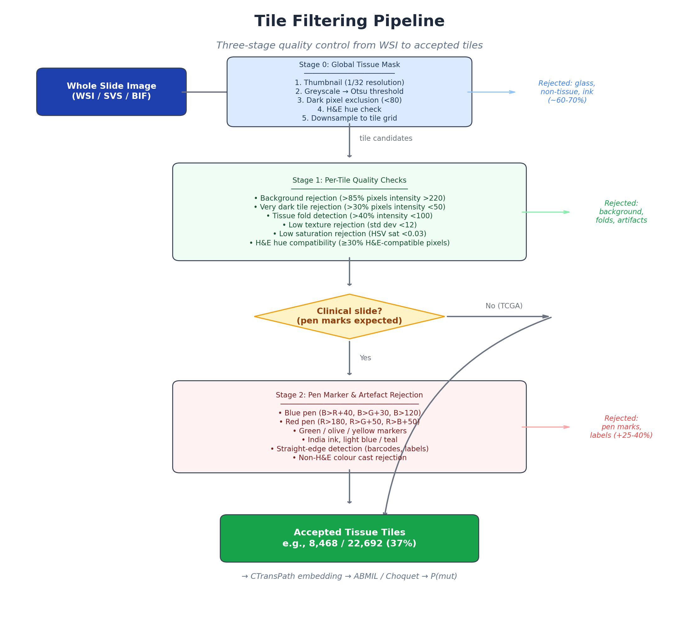
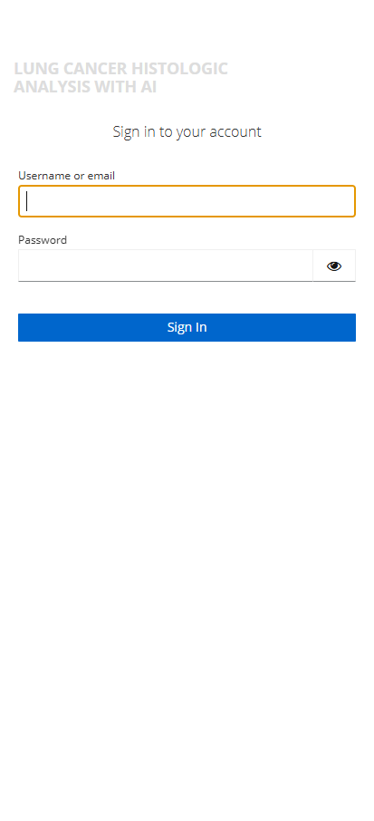
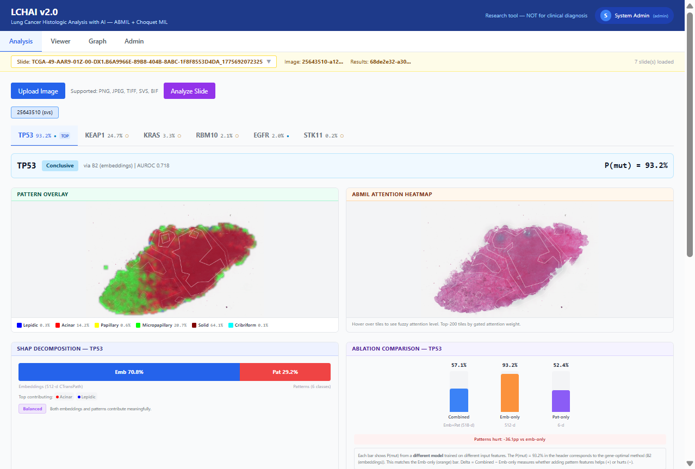
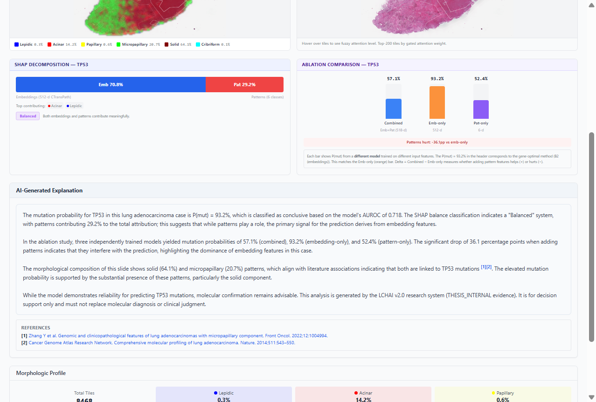
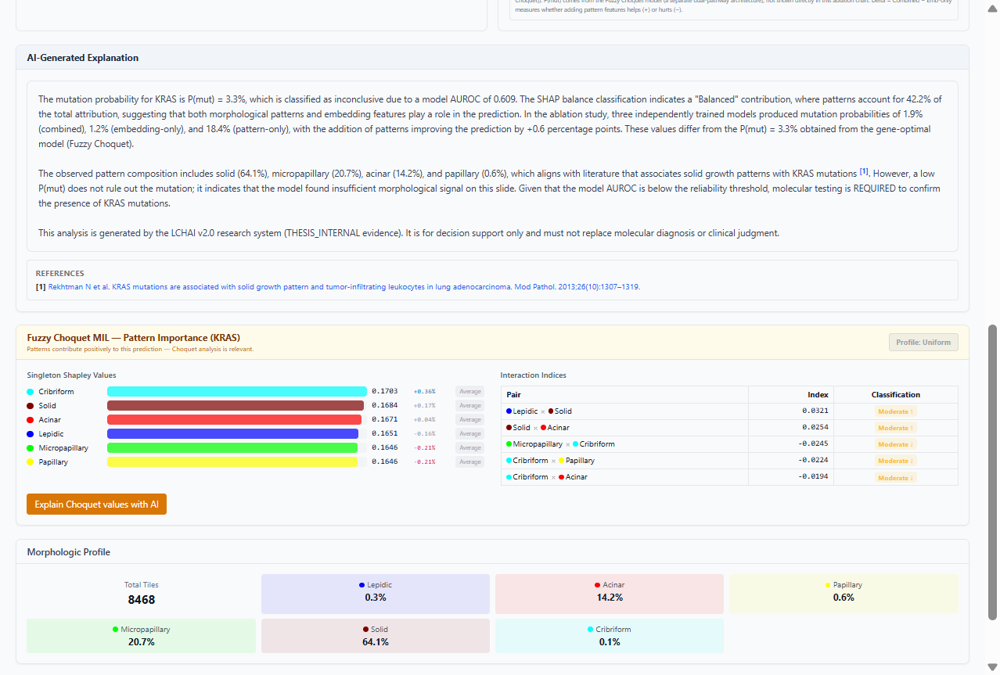
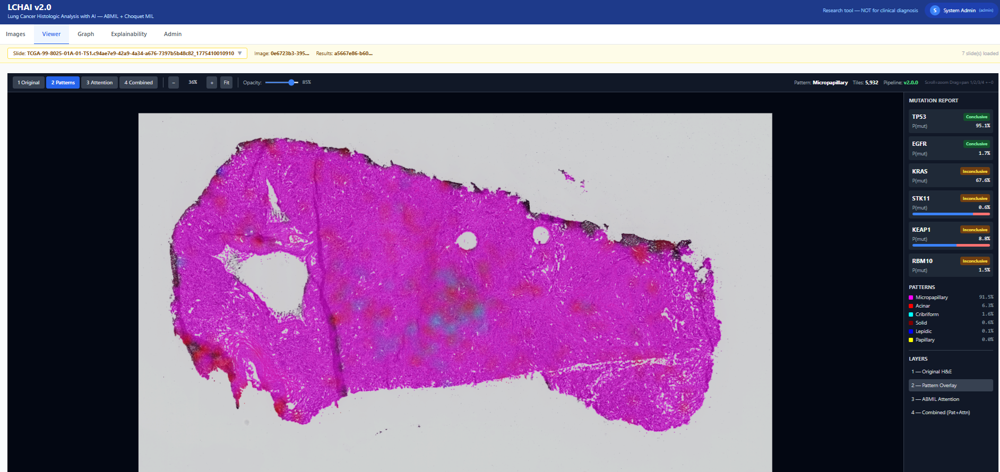
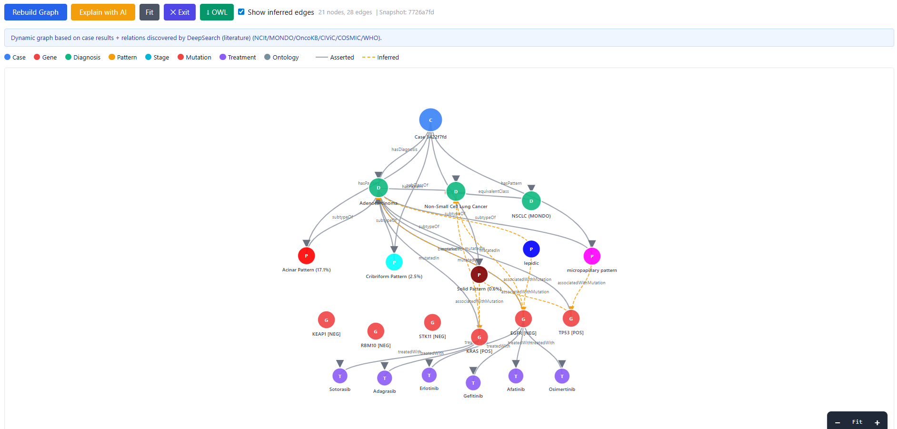
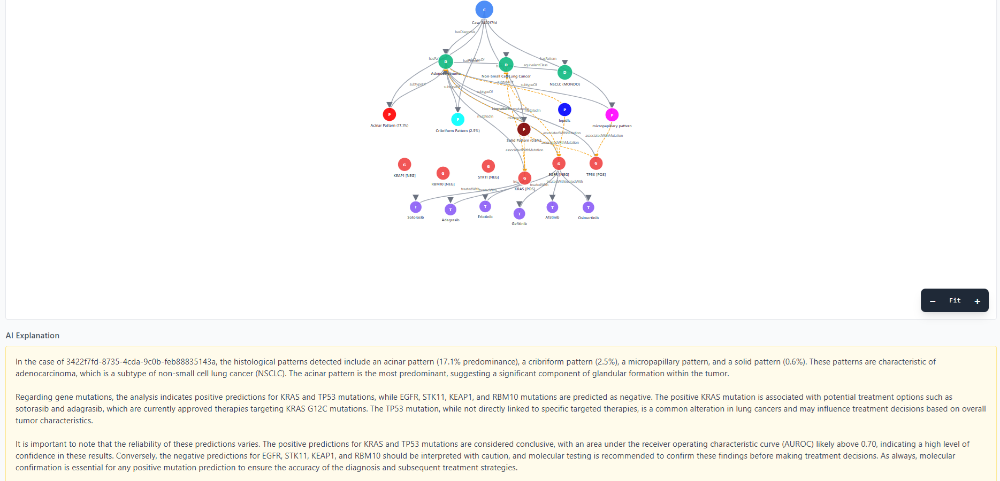
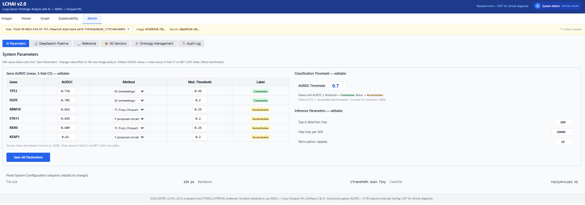
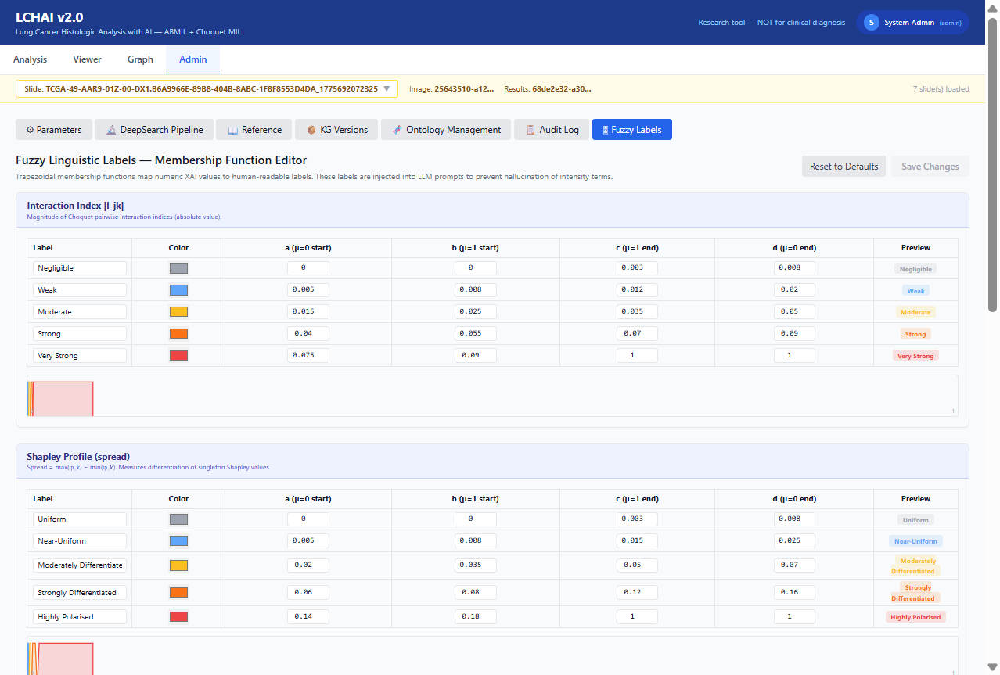

# LCHAI v2.0 — User Manual

**Lung Cancer Histologic Analysis with AI**
*Explainable mutation prediction from H&E whole-slide images*

> DISCLAIMER: LCHAI v2.0 is a research tool (THESIS_INTERNAL evidence). Mutation predictions use ABMIL + Fuzzy Choquet MIL. Inconclusive genes (AUROC < 0.70) require molecular testing. NOT for clinical diagnosis.

---

## Table of Contents

1. [System Overview](#1-system-overview)
2. [Getting Started — Login](#2-getting-started--login)
3. [Analysis Tab — Upload, Analyze, and Explain](#3-analysis-tab--upload-analyze-and-explain)
   - 3.1 [Uploading an Image](#31-uploading-an-image)
   - 3.2 [Analyzing a Slide](#32-analyzing-a-slide)
   - 3.3 [Gene Sub-tabs](#33-gene-sub-tabs)
   - 3.4 [Pattern Overlay and ABMIL Attention Heatmap](#34-pattern-overlay-and-abmil-attention-heatmap)
   - 3.5 [SHAP Decomposition with Fuzzy Balance Label](#35-shap-decomposition-with-fuzzy-balance-label)
   - 3.6 [Ablation Comparison](#36-ablation-comparison)
   - 3.7 [AI-Generated Explanation](#37-ai-generated-explanation)
   - 3.8 [Fuzzy Choquet Analysis (Conditional)](#38-fuzzy-choquet-analysis-conditional)
   - 3.9 [Morphologic Profile](#39-morphologic-profile)
4. [Viewer Tab — Image Exploration](#4-viewer-tab--image-exploration)
5. [Graph Tab — Knowledge Graph](#5-graph-tab--knowledge-graph)
6. [Admin Tab — System Configuration](#6-admin-tab--system-configuration)
7. [User Profile and Settings](#7-user-profile-and-settings)
8. [Supported Image Formats](#8-supported-image-formats)
9. [Understanding the Results](#9-understanding-the-results)
10. [Fuzzy Linguistic Labels](#10-fuzzy-linguistic-labels)
11. [Troubleshooting](#11-troubleshooting)

---

## 1. System Overview

LCHAI v2.0 is an AI-powered decision-support system for lung adenocarcinoma (LUAD) histopathology. It analyzes whole-slide images (WSI) to:

- **Classify histological growth patterns**: lepidic, acinar, papillary, micropapillary, solid, cribriform
- **Predict oncogenic mutations**: TP53, EGFR, KRAS, STK11, KEAP1, RBM10
- **Provide six-level explainability**: attention maps, pattern overlays, SHAP decomposition, Choquet Shapley values, per-slide ablation, and fuzzy linguistic labels
- **Generate knowledge graphs** linking predictions to biomedical ontologies (NCIt, MONDO) and treatment associations
- **Produce AI-generated explanations** grounded in the knowledge graph with numbered PubMed citations

### ML Pipeline Summary

*Figure 1: Three-stage tile filtering pipeline from WSI to accepted tissue tiles*

1. **WSI Decode** — Opens the slide file (SVS, TIFF, or BIF) using OpenSlide
2. **Tile Filtering** — Three-stage quality control rejects glass, artifacts, pen marks (see Figure 1)
3. **CTransPath Inference** (GPU) — Each tile produces a 512-dimensional embedding
4. **Pattern Classification** — FuzzyArcLoss V2 classifies each tile into 1 of 6 histological patterns
5. **Mutation Prediction** — Gene-specific models (ABMIL or Fuzzy Choquet MIL) predict mutation probability
6. **Explainability** — Ablation, SHAP decomposition, Choquet Shapley values, and fuzzy linguistic labels

---

## 2. Getting Started — Login

Navigate to the LCHAI system (`https://lchai.gptfy.biz` or `http://localhost:3000`). You will be redirected to the Keycloak authentication page.

*Figure 2: Keycloak login screen*

| Method | Description |
|--------|-------------|
| **Username / Password** | Enter your assigned credentials (e.g., `admin1` / `admin1`) |
| **Google** | Click "Google" to sign in with your Google account (OAuth2) |

### User Roles

| Role | Access |
|------|--------|
| **Clinician** | Analysis, Viewer, Graph tabs |
| **Admin** | All clinician access + Admin tab |
| **Auditor** | Read-only access to audit trail |

---

## 3. Analysis Tab — Upload, Analyze, and Explain

The Analysis tab is the primary workspace. It integrates image upload, mutation prediction, and multi-level explainability into a single unified view.

*Figure 3: Analysis tab showing TP53 (93.2%, Conclusive). Gene sub-tabs at top, side-by-side overlays, SHAP with fuzzy label, and ablation comparison.*

### 3.1 Uploading an Image

1. Click **"Upload Image"** (blue button)
2. Select a histopathology image file (PNG, JPEG, TIFF, SVS, BIF)
3. A progress bar shows upload percentage
4. The system creates a new case and selects the uploaded slide

**Slide Selector**: The yellow bar at the top shows all uploaded slides. Click the dropdown to switch.

### 3.2 Analyzing a Slide

1. Select a slide, then click **"Analyze Slide"** (purple button)
2. A processing modal shows real-time progress:

| Stage | Description | Time |
|-------|-------------|------|
| Decoding image | Opens WSI, creates thumbnail | 5-10s |
| CTransPath inference | GPU processes tiles | 10-30s |
| Mutation prediction | ABMIL/Choquet for 6 genes | 5-10s |
| Ablation + permutation | Model comparison | 10-20s |
| SHAP decomposition | Feature attribution | 5-15s |
| Saving results | Store in database | 2-5s |

Click **"Cancel and discard"** to abort at any time.

### 3.3 Gene Sub-tabs

After processing, gene sub-tabs appear **sorted by descending P(mut)**. The highest-probability mutation is selected by default.

Each tab shows:
- Gene name, P(mut) percentage, and prediction method
- A filled circle (●) for Conclusive genes, empty circle (○) for Inconclusive
- A "TOP" badge on the highest-probability gene

### 3.4 Pattern Overlay and ABMIL Attention Heatmap

Two images are displayed side by side:

| Left: Pattern Overlay | Right: ABMIL Attention Heatmap |
|---|---|
| Tile-level color map of 6 growth patterns | Top-200 tiles by gated attention weight |
| Legend shows pattern names with composition % | Red = high attention |
| **Hover**: shows tile pattern name and % | **Hover**: shows fuzzy attention label (e.g., "High Attention, p97") |

**Pattern Color Legend:**

| Color | Pattern |
|-------|---------|
| Blue | Lepidic |
| Red | Acinar |
| Yellow | Papillary |
| Green | Micropapillary |
| Dark red | Solid |
| Cyan | Cribriform |

### 3.5 SHAP Decomposition with Fuzzy Balance Label

A stacked bar shows what percentage of the prediction comes from:
- **Embeddings** (512-d CTransPath visual texture) — blue
- **Patterns** (6-class histological classification) — red

A **fuzzy linguistic label** classifies the balance:

| Label | Meaning |
|-------|---------|
| Embedding-Dominated | Patterns nearly irrelevant (<10%) |
| Embedding-Led | Patterns provide minor signal (10-25%) |
| Balanced | Both contribute meaningfully (25-55%) |
| Pattern-Led | Patterns are primary signal (55-70%) |
| Pattern-Dominated | Embeddings secondary (>70%) |

### 3.6 Ablation Comparison

Three vertical bars compare P(mut) from **three independently trained models**:
- **Combined** (blue): embeddings + patterns (518-d)
- **Emb-only** (orange): embeddings alone (512-d)
- **Pat-only** (purple): patterns alone (6-d)

A delta indicator shows whether patterns help (+) or hurt (-).

> **Important**: These are three different models, not components of one prediction. The P(mut) in the header comes from the gene-optimal method, which may differ from any bar.

### 3.7 AI-Generated Explanation

*Figure 4: AI-generated explanation with SHAP fuzzy label, ablation interpretation, literature citations [1][2], and PubMed references*

The system generates a structured clinical narrative (8-12 sentences) that:
- States P(mut) and whether it is conclusive or inconclusive
- Describes the SHAP balance using the system's fuzzy label
- Interprets the ablation comparison
- Compares the slide's patterns to literature expectations with **numbered PubMed citations** [1], [2]
- Includes the thesis disclaimer

All fuzzy labels and clinical facts are **system-controlled** — the LLM cannot invent intensity terms or clinical associations.

**References**: Below the explanation, clickable PubMed links for each cited paper.

### 3.8 Fuzzy Choquet Analysis (Conditional)

*Figure 5: Choquet section for KRAS with "Profile: Uniform" badge, per-pattern Shapley labels, and interaction indices with fuzzy classifications*

This section appears **only when patterns contribute positively** (Combined > Emb-only).

| Component | Description |
|-----------|-------------|
| **Profile badge** | Fuzzy classification of Shapley spread (e.g., "Uniform", "Near-Uniform") |
| **Shapley value bars** | Per-pattern importance with individual fuzzy labels (e.g., "Average") |
| **Interaction indices table** | Pairwise synergy/redundancy with fuzzy intensity (e.g., "Moderate Synergy ↑") |
| **Explain with AI** button | LLM interpretation using the system-computed fuzzy labels |

### 3.9 Morphologic Profile

Grid showing total tile count and percentage breakdown of all 6 histological patterns.

---

## 4. Viewer Tab — Image Exploration

The Viewer tab provides an interactive image viewer with zoom, pan, and overlay layers.

*Figure 6: Viewer tab with pattern overlay layer*

### Layer Controls

| Button | Layer | Description |
|--------|-------|-------------|
| **1 Original** | H&E image | The original histopathology image |
| **2 Patterns** | Pattern overlay | Color-coded pattern classification per tile |
| **3 Attention** | ABMIL attention | Heatmap with white contour lines |
| **4 Combined** | Both | Pattern colors + attention contours |

### Navigation

| Action | How |
|--------|-----|
| Zoom in/out | Scroll wheel or `+`/`-` keys |
| Pan | Click and drag |
| Reset view | Click "Fit" or press `0` |
| Switch layers | Press `1`, `2`, `3`, `4` |

### Hover Tooltips

On Pattern and Combined layers, hovering over a tile shows the **pattern name** with a color indicator.

### Active Learning (Pattern Correction)

In Pattern/Combined layers, click **"Correction Mode"** to:
1. Draw a lasso around misclassified tiles
2. Select the correct pattern from the dropdown
3. Submit corrections for delta retraining

---

## 5. Graph Tab — Knowledge Graph

*Figure 7: Knowledge graph linking patterns, genes, treatments, and ontology concepts*

### Building the Graph

Click **"Rebuild Graph"** to generate a case-specific knowledge graph from:
- Predicted mutations and patterns
- NCIt and MONDO ontology relationships
- Treatment associations (OncoKB/FDA guidelines)
- DeepSearch-discovered literature relations

### AI Explanation

Click **"Explain with AI"** to generate a natural language summary in your selected language.

*Figure 8: LLM-generated graph explanation*

---

## 6. Admin Tab — System Configuration

Accessible only to users with the **admin** role. Contains seven sub-tabs:

### Parameters

*Figure 9: System parameters — AUROC values, methods, thresholds*

| Parameter | Description | Default |
|-----------|-------------|---------|
| Gene AUROC values | Mean 5-fold CV AUROC per gene | 0.609–0.718 |
| Method per gene | Optimal model (B2, P, or FC) | From thesis Finding 2 |
| AUROC Threshold | Conclusive/Inconclusive boundary | 0.700 |
| Max tiles per WSI | Tile extraction limit | 20,000 |

### Fuzzy Labels

*Figure 10: Fuzzy linguistic label editor with trapezoidal membership functions*

Edit the five fuzzy scales that classify XAI outputs:
1. **Interaction Index** — Negligible to Very Strong
2. **Shapley Profile** — Uniform to Highly Polarised
3. **SHAP Balance** — Embedding-Dominated to Pattern-Dominated
4. **Shapley Individual** — Average to Strongly Above
5. **ABMIL Attention Level** — Very Low to Very High

Each scale shows editable trapezoidal parameters [a, b, c, d] with real-time SVG preview. Changes take effect immediately in the Analysis tab.

### Other Sub-tabs

| Sub-tab | Purpose |
|---------|---------|
| **DeepSearch Pipeline** | Automated literature search for new gene-pattern-treatment relations |
| **Reference** | Clinical reference tables and method formulas |
| **KG Versions** | Knowledge graph snapshot management |
| **Ontology Management** | NCIt/MONDO ontology update proposals |
| **Audit Log** | System event history with user, case, action, timestamp |

---

## 7. User Profile and Settings

Click your **name** in the top-right corner to access:

- **Profile**: Name, email, role badges
- **Explanation language**: English, Espanol, Deutsch, Francais, Portugues
  - Affects AI-generated explanations in the Analysis and Graph tabs
- **Logout**: End session

---

## 8. Supported Image Formats

| Format | Extension | Notes |
|--------|-----------|-------|
| **SVS** | `.svs` | Recommended. Fastest via OpenSlide |
| **TIFF** | `.tif`, `.tiff` | Flat TIFFs auto-converted to pyramidal |
| **BIF** | `.bif` | Ventana/Roche. Auto-converted via pyvips |
| **PNG** | `.png` | For small sections |
| **JPEG** | `.jpg`, `.jpeg` | For small sections |

---

## 9. Understanding the Results

### Mutation Probability

| P(mut) | Interpretation |
|--------|---------------|
| > 70% | Strong evidence — confirm with molecular testing |
| 50-70% | Moderate evidence — molecular testing recommended |
| 30-50% | Weak signal — molecular testing needed |
| < 30% | Likely wild-type |

### Conclusive vs Inconclusive

- **Conclusive** (AUROC >= 0.70): Reliable prediction. The model has demonstrated acceptable discrimination.
- **Inconclusive** (AUROC < 0.70): Limited accuracy. Molecular testing is strongly recommended.

### Gene-Specific Associations

| Gene | Pattern association | Treatment implications |
|------|--------------------|-----------------------|
| **TP53** | Solid, micropapillary | No targeted therapy; immunotherapy in selected cases |
| **EGFR** | Lepidic, papillary | Osimertinib, erlotinib, gefitinib, afatinib |
| **KRAS** | Solid (mucinous not in taxonomy) | Sotorasib, adagrasib (G12C-specific) |
| **STK11** | Variable (immune-cold) | May predict IO resistance |
| **KEAP1** | Diffuse | NRF2 pathway; affects IO response |
| **RBM10** | Variable | No targeted therapy; splicing biology |

---

## 10. Fuzzy Linguistic Labels

LCHAI uses **trapezoidal fuzzy membership functions** to classify numeric XAI outputs into human-readable intensity terms. These labels are:

- Displayed as badges in the Analysis tab
- Injected into LLM prompts to **prevent hallucination** of intensity terms
- Editable by administrators via Admin > Fuzzy Labels

### The Five Scales

| Scale | Input | Labels |
|-------|-------|--------|
| SHAP Balance | Pattern contribution % | Emb-Dominated → Emb-Led → Balanced → Pat-Led → Pat-Dominated |
| Shapley Profile | Spread (max-min) | Uniform → Near-Uniform → Mod. Diff. → Strongly Diff. → Polarised |
| Shapley Individual | % deviation from uniform | Average → Slightly → Moderately → Strongly Above/Below |
| Interaction Index | \|I_jk\| | Negligible → Weak → Moderate → Strong → Very Strong |
| Attention Level | Tile percentile | Very Low → Low → Moderate → High → Very High |

### Anti-Hallucination

The fuzzy labels create a **dual anti-hallucination mechanism**:
1. **Knowledge Graph** constrains *what* the LLM says (clinical facts with PMID provenance)
2. **Fuzzy labels** constrain *how* it says it (intensity terms computed deterministically)

This ensures the AI explanation matches exactly what is displayed in the interface.

---

## 11. Troubleshooting

| Problem | Solution |
|---------|----------|
| Blank screen after login | Refresh (F5) or clear browser cache |
| Upload stuck at 0% | Check internet connection |
| Processing too slow | Normal ~1min GPU, ~5min CPU. Check Admin > Max tiles |
| No results after processing | Select the correct slide in the dropdown |
| BIF file fails | Large BIFs auto-convert. Check worker logs |
| Admin tab not visible | Requires admin role |
| Explanation in wrong language | Change in user menu (top-right) |
| Attention hover not showing labels | Slide needs re-processing with current pipeline |
| Choquet section not appearing | Only shows when patterns help (Combined > Emb-only) |

### Performance Tips

- Use **SVS format** for large slides
- Keep **Max tiles at 20,000** for balanced accuracy/speed
- **GPU acceleration** reduces processing from ~5 min to ~1 min
- Close other tabs when uploading large files (>2 GB)

---

*LCHAI v2.0 — Servio Fernando Lima Reina, PhD Computer Science, University of Fribourg, Switzerland*
*For research use only. Always confirm AI predictions with molecular testing.*
